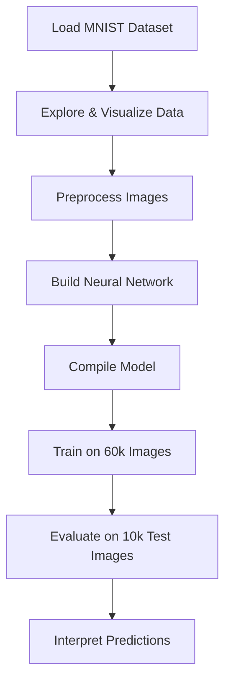
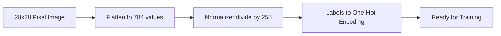
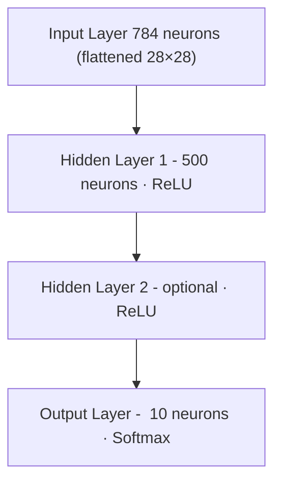
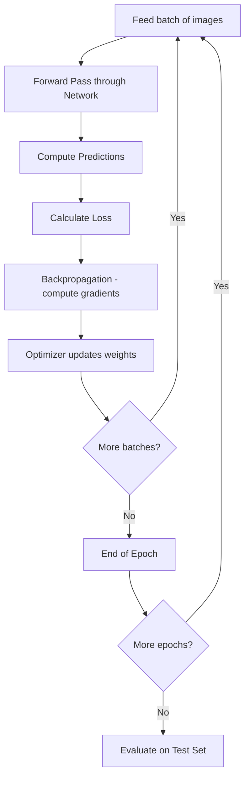
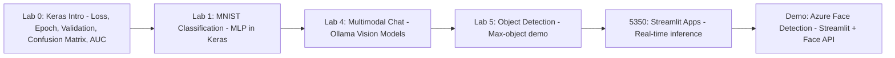
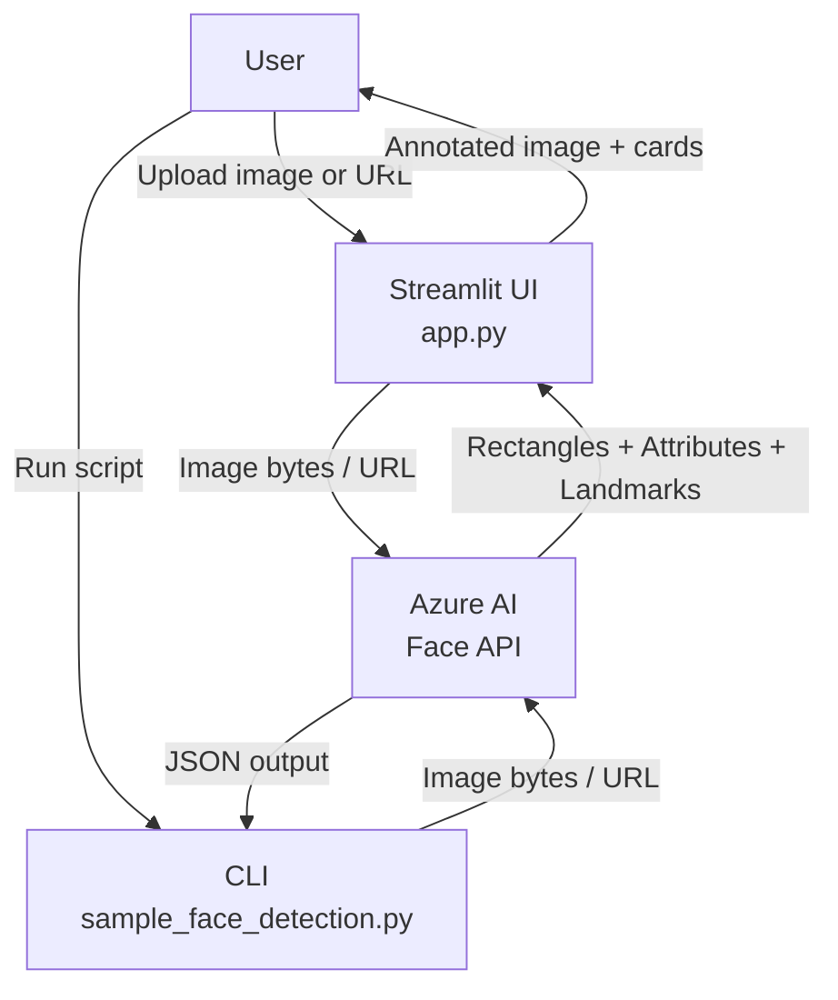
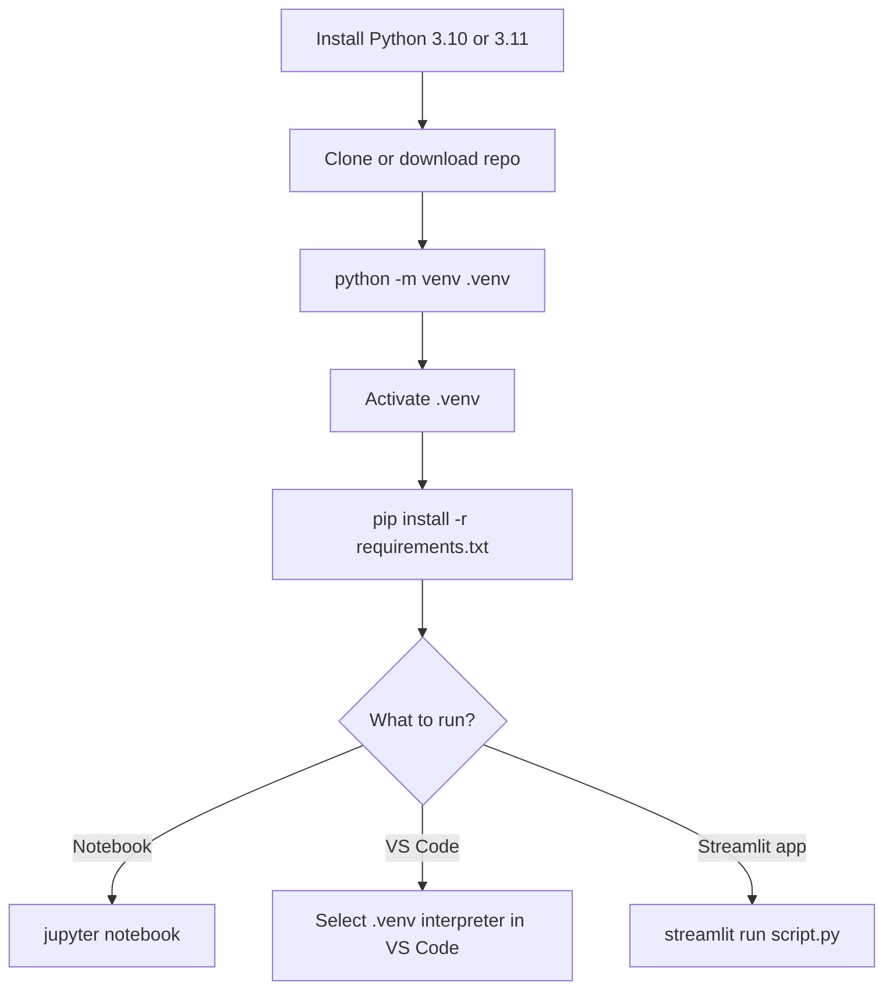
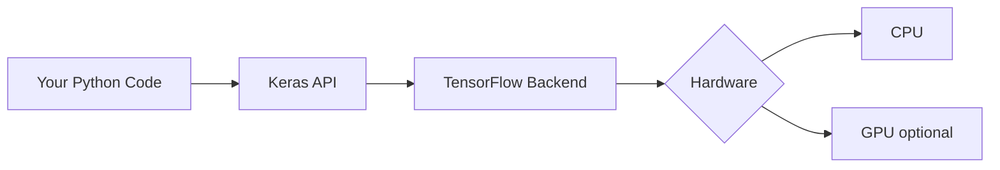

# MNIST Digit Classification Lab — Traditional Deep Learning

In this lab, students build a classic deep learning model that recognizes handwritten digits (0–9) using the **MNIST dataset**. The activity introduces the full workflow for image classification: loading and visualizing data, preprocessing images, designing a neural network, training the model, evaluating accuracy, and interpreting predictions.

MNIST provides a clean, well-structured benchmark dataset, allowing students to focus on core deep learning concepts such as activation functions, loss optimization, overfitting, and test accuracy — skills foundational to all computer vision tasks.

---

## What is MNIST?

The **Modified National Institute of Standards and Technology (MNIST)** dataset is one of the most widely used datasets in machine learning. It contains:

| Split | Images | Labels |
|-------|--------|--------|
| Training set | 60,000 | 0 – 9 |
| Test set | 10,000 | 0 – 9 |

Each image is a **28 × 28 pixel grayscale** photo of a single handwritten digit. Pixel values range from 0 (black) to 255 (white).

---

## Deep Learning Workflow

The following diagram shows the end-to-end pipeline used in this lab:



---

## Data Preprocessing Steps

Raw pixel images must be transformed before being fed into a neural network:



| Step | Why |
|------|-----|
| **Flatten** | Dense layers expect a 1-D input vector (784 = 28 × 28) |
| **Normalize** | Scales pixel values to \[0, 1\]; speeds up gradient descent |
| **One-Hot Encode** | Converts digit `3` → `[0,0,0,1,0,0,0,0,0,0]` so the output layer can compute cross-entropy loss |

---

## Neural Network Architecture (MLP)

The baseline model is a **Multi-Layer Perceptron (MLP)**:



- **ReLU** (Rectified Linear Unit): `f(x) = max(0, x)` — introduces non-linearity, avoids vanishing gradients.
- **Softmax**: converts raw scores into a probability distribution over 10 digit classes.
- **Loss function**: Categorical cross-entropy — measures how far the predicted distribution is from the true one-hot label.
- **Optimizer**: Adam — adaptive learning rate optimizer, works well out of the box.

---

## Training Loop



Key training hyperparameters:

| Parameter | Typical Value | Effect |
|-----------|--------------|--------|
| Epochs | 10 – 20 | More epochs → lower training loss (watch for overfitting) |
| Batch size | 32 – 128 | Larger = faster but noisier gradients |
| Learning rate | 0.001 (Adam default) | Too high = diverges; too low = slow convergence |

---

## Repository Structure

```
MNIST-main/
├── code/                        # Standalone notebook demos
│   ├── MINST.ipynb              #   Full MLP walkthrough with explanations
│   ├── MINST-low-code.ipynb     #   Simplified version for beginners
│   └── sample-MNIST.ipynb       #   Quick sample / starter notebook
│
├── labs/
│   ├── lab-0/                   # Lab 0 — Intro to Keras & TensorFlow (START HERE)
│   │   ├── intro-keras.ipynb
│   │   └── README.md
│   │
│   ├── lab-1/                   # Lab 1 — Core MNIST classification
│   │   ├── MINST.ipynb
│   │   ├── MINST-low-code.ipynb
│   │   └── sample-MNIST.ipynb
│   │
│   ├── lab-4/                   # Lab 4 — Multimodal chat with Ollama
│   │   └── ollama-multi-modal-chat.ipynb
│   │
│   ├── lab-5/                   # Lab 5 — Object detection demo
│   │   └── max-object-demo.ipynb
│   │
    ├── 5350/                    # Advanced — Streamlit + Ollama apps
│   │   ├── mnist_collab.ipynb   #   Collaborative MNIST notebook
│   │   ├── st_detect.py         #   Streamlit image detection app
│   │   ├── st_image.py          #   Streamlit image display app
│   │   ├── st_ollama.py         #   Streamlit + Ollama vision model app
│   │   └── sd/
│   │       └── sd_local.py      #   Stable Diffusion local demo
│   │
│   └── demo/                    # Demo — Azure AI Vision Face Detection
│       ├── app.py               #   Streamlit web UI
│       ├── sample_face_detection.py  #  CLI script
│       ├── tomc1.jpeg           #   Sample image
│       ├── .env                 #   API credentials (not committed)
│       └── README.md
│
├── images/                      # Supporting images / assets
├── samples/                     # Additional sample code
├── requirements.txt             # All Python dependencies
└── verify_env.py                # Environment verification script
```

---

## Labs at a Glance



| Lab | Topic | Key Skills |
|-----|-------|-----------|
| **Lab 0** | Keras & TensorFlow intro | Loss, epoch, validation, confusion matrix, TP/TN/FP/FN, precision, recall, F1, AUC |
| **Lab 1** | Handwritten digit classification | Keras, MLP, training loop, evaluation |
| **Lab 4** | Multimodal image chat | Ollama, vision LLMs, prompt engineering |
| **Lab 5** | Object detection | Model inference, bounding boxes |
| **5350** | Streamlit web apps | Deployment, OpenCV, Ollama API, async |
| **Demo** | Azure AI Vision Face Detection | Azure Face API, Streamlit UI, PIL bounding boxes |

---

## Demo Lab — Azure AI Vision Face Detection

**Folder:** `labs/demo/`

Detects and analyses faces in images using the **Azure AI Vision Face API**. Provides both a CLI script and an interactive **Streamlit** web UI that draws bounding boxes and displays attributes such as blur, head pose, mask detection, and quality score.



**Prerequisites:**

1. An [Azure AI Services](https://portal.azure.com) resource with the Face API enabled.
2. Add credentials to `labs/demo/.env`:
   ```
   AZURE_FACE_API_ENDPOINT=https://<your-resource>.cognitiveservices.azure.com/
   AZURE_FACE_API_ACCOUNT_KEY=<your-key>
   ```

**Run the Streamlit UI:**

```bash
cd labs/demo
streamlit run app.py
# → http://localhost:8501
```

**Run the CLI script:**

```bash
cd labs/demo
python sample_face_detection.py
```

See `labs/demo/README.md` for full details, attribute reference, and architecture diagrams.

---

## Getting Started

### 1. Requirements

- **Python 3.10 or 3.11** (recommended; TensorFlow does not yet support 3.12+)
- Git (to clone the repo)
- A terminal — PowerShell, zsh, or bash all work

### 2. Create a Virtual Environment

Using a virtual environment keeps your system Python clean and ensures every student has the same package versions.

**macOS / Linux**

```bash
# Clone the repo (skip if you already have the folder)
git clone https://github.com/iportilla/MNIST-main.git
cd MNIST-main

# Create the virtual environment
python3 -m venv .venv

# Activate it
source .venv/bin/activate
```

**Windows (PowerShell)**

```powershell
# Clone the repo (skip if you already have the folder)
git clone https://github.com/iportilla/MNIST-main.git
cd MNIST-main

# Create the virtual environment
python -m venv .venv

# Activate it
.venv\Scripts\Activate.ps1
```

> **Tip:** Your prompt will change to show `(.venv)` when the environment is active.  
> Run `deactivate` at any time to leave it.

### 3. Install Dependencies

```bash
  pip install --upgrade pip
  pip install -r requirements.txt
```

The `requirements.txt` at the root of this repo installs everything needed for Labs 1–5.  
GPU-only packages (Stable Diffusion, YOLO) are commented out — uncomment them only if needed.

### 4. Verify the Installation

A verification script is included at the repo root:

```bash
python verify_env.py
```

The script checks every required package and prints a pass/fail table:

```
=======================================================
  MNIST Lab — Environment Verification
=======================================================
  Python 3.11.x ...
=======================================================
  Package            Status    Version
-------------------------------------------------------
  tensorflow         [ OK  ]   2.15.0
  keras              [ OK  ]   2.15.0
  numpy              [ OK  ]   1.26.4
  ...
-------------------------------------------------------
  9 passed, 0 failed
=======================================================

  All packages found. You are ready to go!
```

If any package shows `FAIL`, make sure your `.venv` is active and re-run `pip install -r requirements.txt`.

### 5. Run a Notebook

Open any `.ipynb` file in Jupyter or VS Code and run cells top-to-bottom. Start with:

```
code/MINST-low-code.ipynb   ← recommended for first-timers
code/MINST.ipynb            ← full version with detailed explanations
```

**Launch Jupyter in the browser:**

```bash
jupyter notebook
```

**Or open in VS Code** — press `Ctrl+Shift+P` → *Python: Select Interpreter* → choose `.venv`.

### 6. Run a Streamlit App (5350 labs)

Ollama must be running locally before starting the vision apps.

```bash
# Start Ollama (separate terminal, one-time install at ollama.com)
ollama serve

# Then in your (.venv) terminal:
cd labs/5350
streamlit run st_detect.py
# or
streamlit run st_ollama.py
```

### Environment Setup Flow



---

## Key Tools & Technologies

### Virtual Environment (venv)

A **virtual environment** is an isolated Python installation created inside your project folder. It has its own copy of `pip` and its own set of installed packages, completely separate from your system Python.

**Why it matters for students:**
- Different labs may need different package versions — venv prevents conflicts.
- No administrator rights are required to install packages inside a venv.
- Deleting the `.venv` folder completely removes all installed packages without touching the rest of your system.

```
.venv/
├── bin/        ← python, pip executables (macOS/Linux)
├── Scripts/    ← python.exe, pip.exe (Windows)
└── lib/        ← all installed packages live here
```

### TensorFlow

**TensorFlow** is an open-source machine learning framework developed by Google. It provides:
- Efficient numerical computation using tensors (multi-dimensional arrays)
- Automatic differentiation for computing gradients during backpropagation
- Support for training on CPU, GPU, and TPU hardware
- A complete ecosystem: data loading, model building, training, export, and deployment

In this lab, TensorFlow is the **engine** that runs all computations behind the scenes.



### Keras

**Keras** is a high-level deep learning API that runs on top of TensorFlow. It was designed to be readable and fast to prototype with. Keras lets you:
- Define a model layer-by-layer using plain Python
- Compile the model with a single line specifying the optimizer and loss function
- Train using `model.fit()` — Keras handles batching, shuffling, and progress bars automatically
- Evaluate and make predictions with `model.evaluate()` and `model.predict()`

Keras is to TensorFlow what a steering wheel is to an engine — it gives you a simple interface to control powerful machinery.

| Keras call | What it does |
|---|---|
| `model = Sequential()` | Create a linear stack of layers |
| `model.add(Dense(500, activation='relu'))` | Add a fully-connected hidden layer |
| `model.compile(optimizer='adam', loss='categorical_crossentropy', metrics=['accuracy'])` | Configure training |
| `model.fit(X_train, y_train, epochs=10)` | Train the model |
| `model.evaluate(X_test, y_test)` | Measure test accuracy |

---

## Key Concepts Glossary

| Term | Definition |
|------|-----------|
| **Epoch** | One complete pass through the entire training dataset |
| **Batch** | A subset of training examples processed together in one forward/backward pass |
| **Overfitting** | Model learns training data too well and performs poorly on new data |
| **Dropout** | Regularization technique that randomly zeros activations during training |
| **Accuracy** | Fraction of predictions that match the true label |
| **Loss** | Numeric measure of how wrong the model's predictions are |
| **Backpropagation** | Algorithm to compute gradients of the loss w.r.t. each weight |
| **One-Hot Encoding** | Representing a class label as a binary vector with a single 1 |

