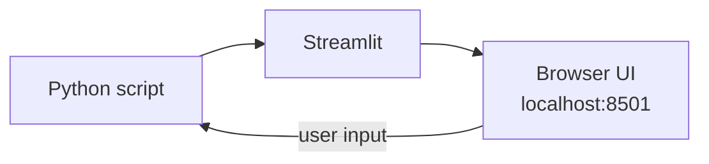
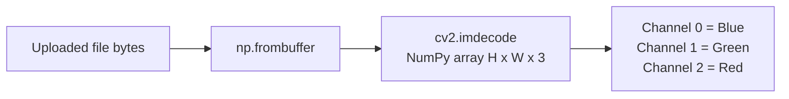
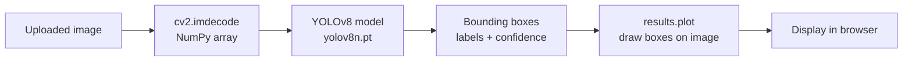
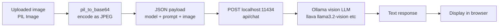
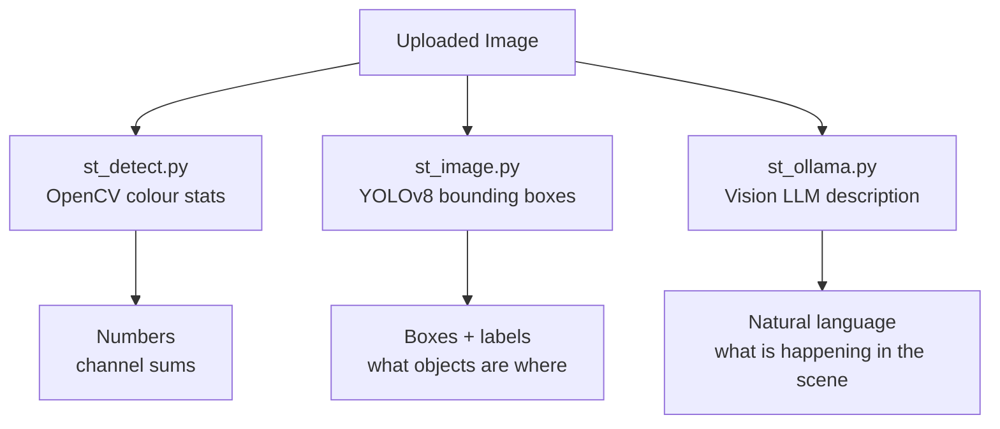

# Lab 5350 — Applied AI: Streamlit Apps & Vision Models

This lab moves beyond training models and into **deploying AI as interactive applications**.  
You will build and run four different apps that demonstrate how the same underlying ideas — image processing, neural networks, and language models — are packaged for real users.

Everything runs locally. No cloud account or API key is required (except Hugging Face for the SD lab).

---

## Prerequisites

Complete **Lab 0** and **Lab 1** before starting here.  
You should be comfortable with:

- MNIST classification with Keras
- What a neural network input/output looks like
- Running Python scripts from a terminal

---

## What is Streamlit?

**Streamlit** is a Python library that turns a plain `.py` script into a browser-based web app with zero HTML or JavaScript. You write Python; Streamlit renders sliders, buttons, file uploaders, and charts automatically.

```
streamlit run yourscript.py
```

A browser tab opens at `http://localhost:8501`. Every time you save the file, the page reloads.



---

## Files in This Lab

| File | What it does |
|------|-------------|
| `st_detect.py` | Upload an image — extracts basic colour features using OpenCV |
| `st_image.py` | Upload an image — runs YOLOv8 object detection and draws bounding boxes |
| `st_ollama.py` | Upload an image — sends it to a local Ollama vision LLM for a text description |
| `mnist_collab.ipynb` | Full MNIST training notebook (same pipeline as Lab 1, collab-style) |
| `sd/` | Stable Diffusion text-to-image generator (see `sd/README.md`) |

---

## App 1 — st_detect.py (Basic Image Features)

This is the simplest app. It uploads an image, decodes it with **OpenCV**, and reports the sum of each colour channel (red, green, blue).

### What it teaches
- How to read image bytes from a Streamlit file uploader
- How OpenCV represents images as NumPy arrays (height × width × 3 channels)
- How BGR channel order differs from the RGB you might expect

### Run it
```bash
streamlit run st_detect.py
```

### How OpenCV stores an image



> OpenCV uses **BGR** (Blue-Green-Red), not RGB. This is a common source of confusion — colours look wrong if you forget to swap the channels when displaying.

---

## App 2 — st_image.py (YOLOv8 Object Detection)

This app uses **YOLOv8**, a state-of-the-art real-time object detector, to find and label objects in any uploaded photo.

### What it teaches
- How a pre-trained model can be used without any training on your part
- What **object detection** produces: bounding boxes + class labels + confidence scores
- How `@st.cache_resource` prevents the model reloading on every interaction

### Run it
```bash
pip install ultralytics opencv-python-headless
streamlit run st_image.py
```

### Detection pipeline



### What is a confidence score?

Every detected object comes with a number between 0 and 1 — the model's certainty that the detection is correct.

| Confidence | Interpretation |
|-----------|---------------|
| > 0.8 | High confidence |
| 0.5 – 0.8 | Moderate — probably correct |
| < 0.5 | Low — treat with caution |

`yolov8n.pt` is the smallest ("nano") YOLOv8 model. It downloads automatically on first run (~6 MB).

---

## App 3 — st_ollama.py (Vision Language Model)

This app sends an uploaded image to a **locally running vision LLM** (via Ollama) and receives a text description. The model sees the image and responds in natural language — no cloud required.

### What it teaches
- How multimodal models process both images and text together
- How to call a local HTTP API from Python (`httpx`)
- How images are transmitted as **base64-encoded strings** in JSON payloads
- The difference between a vision LLM and an object detector

### Prerequisites — Ollama must be running

```bash
# Install Ollama from https://ollama.com then:
ollama pull llava:7b          # or llama3.2-vision, moondream, etc.
ollama serve                  # starts the local API on port 11434
```

### Run it
```bash
streamlit run st_ollama.py
```

### Request flow



### Vision LLM vs Object Detector

| | Object Detector (YOLO) | Vision LLM (LLaVA) |
|---|---|---|
| Output | Bounding boxes + labels | Free-form text description |
| Speed | Very fast (milliseconds) | Slower (seconds) |
| Flexibility | Fixed set of 80 COCO classes | Can describe anything |
| Use case | Real-time detection | Rich understanding / Q&A |

### Available vision models for Ollama

| Model | Size | Capability |
|-------|------|-----------|
| `moondream` | ~1.7 GB | Fast, lightweight |
| `llava:7b` | ~4 GB | Good general vision |
| `llava:13b` | ~8 GB | Better, needs more RAM |
| `llama3.2-vision` | ~6 GB | Strong reasoning |

---

## App 4 — mnist_collab.ipynb (MNIST Notebook)

A full MNIST classification notebook structured for collaborative work — same pipeline as Lab 1 but extended with additional visualisation cells including an individual prediction viewer.

Open it in Jupyter or VS Code and run cells top to bottom.

---

## App 5 — sd/ (Stable Diffusion)

Text-to-image generation running entirely on your machine. See [sd/README.md](sd/README.md) for full setup instructions.

---

## Running All Apps

```bash
# Activate the shared virtual environment
source ../../.venv/bin/activate   # macOS/Linux
..\..\\.venv\Scripts\Activate.ps1  # Windows

# Then run whichever app you want
streamlit run st_detect.py
streamlit run st_image.py
streamlit run st_ollama.py
```

Each app runs on `http://localhost:8501`. Stop it with **Ctrl+C** and start another.

---

## Install Dependencies

```bash
# Core (already in requirements.txt)
pip install streamlit opencv-python numpy pillow httpx

# For st_image.py only
pip install ultralytics

# For st_ollama.py only — also requires Ollama installed separately
# https://ollama.com
```

---

## How the Three Apps Compare



Each approach answers a different question about the same image — from simple statistics to full scene understanding.

---

## What's Next?

- Combine the apps: use YOLO detections as context for an LLM prompt
- Add the MNIST model from Lab 1 as a fourth classifier in a new Streamlit app
- Try Stable Diffusion in `sd/` to generate images, then classify them
