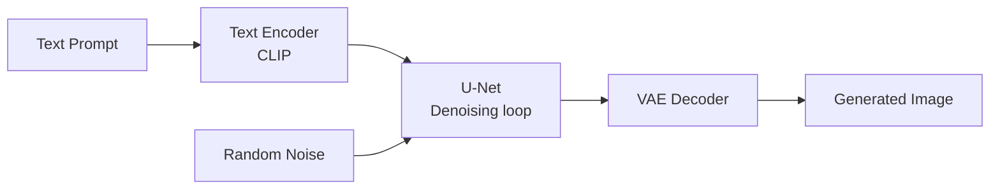
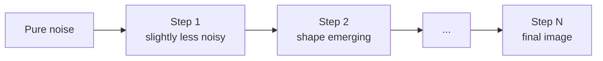
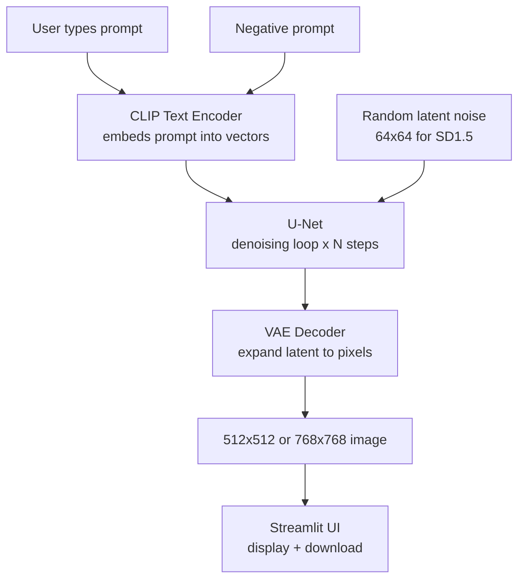

# Local Stable Diffusion — Offline Image Generator

This lab runs a fully offline AI image generator on your own machine using **Stable Diffusion**, **Hugging Face Diffusers**, and a **Streamlit** web UI.  
No cloud, no API key, no cost — everything stays on your laptop.

Supported hardware:
- **Apple Silicon (M1/M2/M3/M4)** — uses Metal (MPS) GPU acceleration
- **NVIDIA GPU** — uses CUDA
- **CPU only** — works but is slow (minutes per image instead of seconds)

---

## What is Stable Diffusion?

Stable Diffusion is a **text-to-image** deep learning model. You type a description (a *prompt*) and the model generates a matching image from random noise — entirely on your hardware.

### How it works — the three key components



| Component | What it does |
|-----------|-------------|
| **Text Encoder (CLIP)** | Converts your prompt into a list of numbers (embeddings) that capture meaning |
| **U-Net** | Runs the denoising loop — starts from pure noise and gradually refines it guided by the text embeddings |
| **VAE Decoder** | Converts the compressed latent representation back into a full-resolution pixel image |

### The denoising loop (inference steps)



Each step the U-Net predicts and removes a little noise, guided by your prompt.  
More steps = better quality but slower. Typical range: **20–50 steps**.

### Guidance Scale

The **guidance scale** (CFG scale) controls how strictly the image follows your prompt vs. being more creative.

| Value | Effect |
|-------|--------|
| 1 – 4 | Ignores prompt, very random |
| 7 – 9 | Good balance — recommended default |
| 12 + | Follows prompt very strictly, can look over-saturated |

---

## SD 1.5 vs SDXL — What is the difference?

| Feature | Stable Diffusion 1.5 | Stable Diffusion XL |
|---------|---------------------|-------------------|
| Release | 2022 | 2023 |
| Best resolution | 512 × 512 | 768 × 768 or higher |
| Model size | ~4 GB | ~7 GB |
| Speed on M-series | Fast | Moderate |
| Image quality | Good | Better detail and realism |
| Data type on MPS | **float32** (required) | float16 |

> **Why float32 for SD1.5 on MPS?**  
> Apple's Metal GPU uses float16 by default, but SD1.5's VAE decoder produces black images in float16 on MPS — a known upstream bug. Running in float32 fixes it. SDXL does not have this problem.

---

## Project Structure

```
sd/
├── sd_local.py          # Main Streamlit app
├── sd15/                # Stable Diffusion 1.5 model (downloaded separately)
├── sdxl/                # Stable Diffusion XL model (downloaded separately)
└── README.md
```

The model folders (`sd15/`, `sdxl/`) are **not included** in the repo — they are several gigabytes each. You download them once with the Hugging Face CLI (see below).

---

## Installation

### Step 1 — Create a virtual environment

```bash
# Using venv (recommended)
python3 -m venv sd
source sd/bin/activate       # macOS / Linux
sd\Scripts\Activate.ps1      # Windows
```

Or with conda:

```bash
conda create -n sd python=3.10
conda activate sd
```

### Step 2 — Install dependencies

```bash
pip install diffusers transformers accelerate scipy safetensors
pip install torch --index-url https://download.pytorch.org/whl/cpu
pip install streamlit
pip install invisible-watermark   # optional, suppresses a warning
```

> On macOS, the CPU PyTorch wheel automatically enables Metal (MPS) — no separate install needed.

---

## Download Models

You need a free Hugging Face account. Log in once:

```bash
huggingface-cli login
```

### Stable Diffusion 1.5

```bash
huggingface-cli download runwayml/stable-diffusion-v1-5 \
    --local-dir sd15 --local-dir-use-symlinks False
```

### Stable Diffusion XL

```bash
huggingface-cli download stabilityai/stable-diffusion-xl-base-1.0 \
    --local-dir sdxl --local-dir-use-symlinks False
```

### Token-free alternatives (no login needed)

```bash
# SD1.5 replacement
huggingface-cli download dreamlike-art/dreamlike-photoreal-2.0 \
    --local-dir sd15 --local-dir-use-symlinks False

# SDXL replacement
huggingface-cli download SG161222/RealVisXL_V4.0 \
    --local-dir sdxl --local-dir-use-symlinks False
```

---

## Running the App

```bash
streamlit run sd_local.py
```

A browser tab opens at `http://localhost:8501`. Fill in a prompt and click **Generate**.

---

## Memory Optimizations (Apple Silicon)

Large models can exceed available GPU memory. The app automatically enables three techniques:

| Technique | What it does |
|-----------|-------------|
| `enable_attention_slicing()` | Computes attention in smaller chunks — trades speed for memory |
| `enable_vae_tiling()` | Decodes the image in tiles instead of all at once |
| `enable_sequential_cpu_offload()` | Moves model layers to CPU when not in use, then back to GPU |

If you still run out of memory:
1. Reduce image resolution (e.g. 512×512 instead of 768×768)
2. Reduce inference steps (e.g. 20 instead of 50)
3. Switch from SDXL to SD1.5

---

## Prompt Tips for Students

A good prompt has three parts:

```
[subject], [style/medium], [quality boosters]
```

**Example:**
```
a golden retriever in a sunflower field, oil painting, highly detailed, warm lighting, 4k
```

**Negative prompt** — tell the model what to avoid:
```
blurry, low quality, distorted, extra limbs, watermark
```

| Prompt element | Example |
|---------------|---------|
| Subject | `a medieval castle`, `a robot chef` |
| Style | `photorealistic`, `watercolour`, `pencil sketch`, `anime` |
| Lighting | `golden hour`, `dramatic lighting`, `soft studio light` |
| Quality | `highly detailed`, `sharp focus`, `8k`, `award winning` |
| Negative | `blurry`, `ugly`, `deformed`, `low resolution` |

---

## Troubleshooting

**Black or very dark images**  
Only affects SD1.5 on Apple Silicon. The app already forces `float32` to fix this. If you see it, check that you are using `sd_local.py` from this repo and not a custom script.

**Out of memory error**  
Lower the resolution or step count first. If the error persists, restart the app — MPS memory is not always released between runs. The app calls `torch.mps.empty_cache()` automatically, but a full restart is sometimes needed.

**`FileNotFoundError` for model directory**  
The model was not downloaded or was saved to a different folder. Re-run the `huggingface-cli download` command with the exact `--local-dir` path shown above.

**Streamlit port already in use**  
```bash
streamlit run sd_local.py --server.port 8502
```

---

## Architecture — Full Pipeline



---

## Ideas for Extension

The app is intentionally minimal. Try extending it:

- **Img2Img** — start from an existing image instead of pure noise
- **Inpainting** — mask part of an image and regenerate just that region
- **LoRA loading** — plug in a small fine-tuned adapter to change the art style
- **Prompt enhancement** — pass the prompt through a local LLM (Ollama) before sending to SD
- **Batch generation** — generate multiple images in one run and compare them
- **SDXL Refiner** — run a second refinement pass for sharper detail

---

## License

Code in this lab: MIT License.  
Model weights: each model has its own licence on Hugging Face — check before commercial use.
