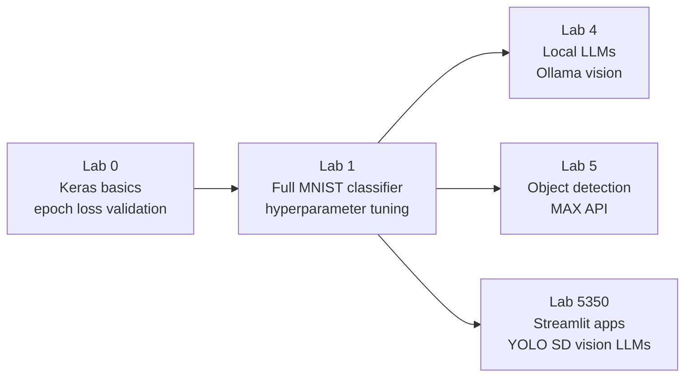

# Labs — Overview

This folder contains all labs for the course, ordered from foundational deep learning concepts through to applied AI applications.



---

## Lab 0 — Introduction to Keras & TensorFlow

**Folder:** `lab-0/`  
**Notebook:** `intro-keras.ipynb`

Builds intuition for the three concepts you will encounter in every training run before writing complex code.

| Concept | What you learn |
|---------|---------------|
| Epoch | One complete pass through the training dataset |
| Loss | A number measuring how wrong the model's predictions are |
| Validation | Evaluating on held-out data the model has never seen |
| Confusion Matrix | Which classes the model confuses with each other |
| Precision / Recall / F1 | Per-class metrics beyond raw accuracy |

The model trains in under a minute and reaches ~98 % accuracy on MNIST.  
See `lab-0/README.md` for full concept explanations.

---

## Lab 1 — Full MNIST Classifier

**Folder:** `lab-1/`  
**Notebooks:** `MINST.ipynb`, `MINST-low-code.ipynb`, `sample-MNIST.ipynb`

Applies Lab 0 concepts to train a production-quality MNIST classifier and experiment with architecture choices.

| Topic | What you learn |
|-------|---------------|
| ReLU & Softmax | Visualise the activation functions as graphs |
| Hyperparameter tuning | Compare Dense(500) vs Dense(50), batch sizes, epoch counts |
| Dropout | Regularisation to reduce overfitting |
| Loss & accuracy curves | How to read training history to diagnose problems |

See `lab-1/README.md` for architecture diagrams and experiment results.

---

## Lab 4 — Local LLMs with Ollama

**Folder:** `lab-4/`  
**Notebook:** `ollama-multi-modal-chat.ipynb`

Runs a **vision-capable large language model** entirely on your laptop using Ollama. You provide an image file; the model returns a natural-language description.

| Topic | What you learn |
|-------|---------------|
| Ollama | Running LLMs locally without a cloud API |
| Multimodal models | Models that accept both images and text as input |
| Vision LLMs | `llama3.2-vision`, `gemma3`, `llava` — how to call them from Python |
| `eval_duration` | Measuring inference speed |

**Prerequisites:** Install Ollama from [ollama.com](https://ollama.com) and pull a vision model:

```bash
ollama pull llama3.2-vision   # or gemma3, llava:7b
ollama serve
```

Then run the notebook cells top to bottom.

---

## Lab 5 — Object Detection with MAX

**Folder:** `lab-5/`  
**Notebook:** `max-object-demo.ipynb`

Calls the **IBM MAX Object Detector** microservice to find objects in an image, extract bounding boxes, and visualise results with matplotlib.

| Topic | What you learn |
|-------|---------------|
| REST API calls | Posting an image to a model microservice with `requests` |
| Bounding boxes | How object detectors return coordinates, labels, and confidence |
| Visualisation | Drawing detection results over an image with matplotlib patches |
| Model-as-a-service | Using a pre-deployed model without training anything yourself |

**Prerequisites:** The MAX Object Detector must be running. Use the hosted demo or run it locally via Docker:

```bash
docker run -it -p 5000:5000 codait/max-object-detector
```

---

## Lab 5350 — Applied AI: Streamlit Apps & Vision Models

**Folder:** `5350/`

Deploys AI as interactive browser apps using Streamlit. Covers three progressively more powerful approaches to image understanding, plus Stable Diffusion text-to-image generation.

| App / File | Topic |
|-----------|-------|
| `st_detect.py` | OpenCV colour feature extraction |
| `st_image.py` | YOLOv8 real-time object detection |
| `st_ollama.py` | Local vision LLM via Ollama |
| `mnist_collab.ipynb` | Extended MNIST notebook |
| `sd/` | Stable Diffusion text-to-image (offline) |

```bash
streamlit run 5350/st_image.py
```

See `5350/README.md` and `5350/sd/README.md` for full setup instructions.

---

## Getting Started

```bash
# 1. Clone / download the repo and enter the folder
cd MNIST-main

# 2. Create and activate a virtual environment
python3 -m venv .venv
source .venv/bin/activate      # macOS/Linux
.venv\Scripts\Activate.ps1     # Windows

# 3. Install all dependencies
pip install -r requirements.txt

# 4. Start with Lab 0
jupyter notebook labs/lab-0/intro-keras.ipynb
```

**Recommended order for new students:** Lab 0 → Lab 1 → Lab 4 → Lab 5 → Lab 5350
