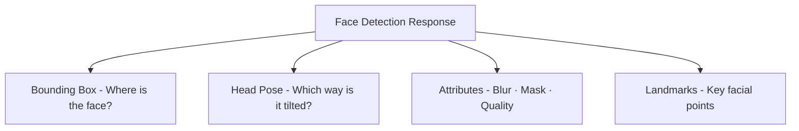
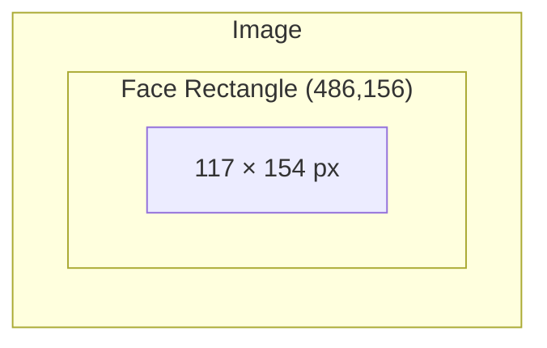
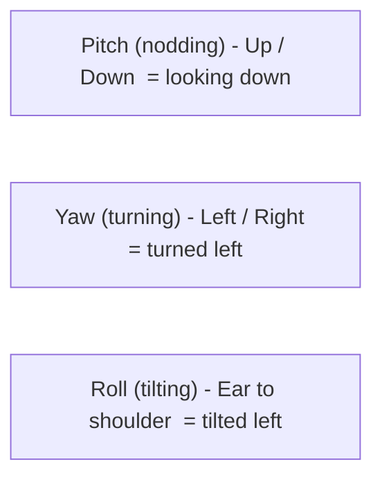
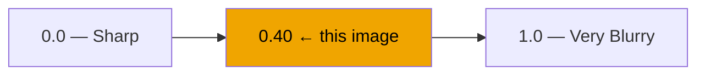
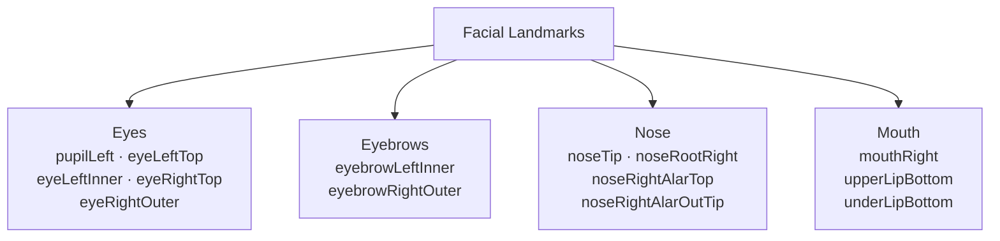

# Azure Face API — Detection Results Explained

This document walks through a real detection result returned by the Azure AI Vision Face API and explains what every field means.

---

## What the API Returns

When you submit an image, the Face API analyses each detected face and returns a structured response containing four main sections:



---

## 1. Bounding Box

```
Bounding Box — top: 156, left: 486, width: 117, height: 154
```

The bounding box is a rectangle that frames the detected face in the image. All values are in **pixels**, measured from the top-left corner of the image.

| Field | Value | Meaning |
|-------|-------|---------|
| `top` | 156 | Distance from the top edge of the image to the top of the face rectangle |
| `left` | 486 | Distance from the left edge of the image to the left side of the face rectangle |
| `width` | 117 | How wide the face rectangle is |
| `height` | 154 | How tall the face rectangle is |



> The bottom-right corner of the box is at pixel **(486 + 117, 156 + 154) = (603, 310)**.

---

## 2. Head Pose

```
Pitch  -12.2°
Yaw    -7.9°
Roll   -8.6°
```

Head pose describes the **3-D orientation of the head** using three rotation angles, all measured in degrees. Think of the head as an aircraft:



| Angle | Value | Interpretation |
|-------|-------|----------------|
| **Pitch** | −12.2° | Head is tilted slightly **downward** (chin toward chest) |
| **Yaw** | −7.9° | Head is turned slightly **to the left** |
| **Roll** | −8.6° | Head is leaning slightly **toward the left shoulder** |

All three values are close to 0°, meaning the face is nearly front-on but with a slight downward and leftward orientation — a natural, relaxed head position.

> **Why it matters:** Large pitch/yaw angles reduce face recognition accuracy because the model sees less of the face. The API uses this to score `qualityForRecognition`.

---

## 3. Attributes

### Blur

```
Blur — level: BlurLevel.MEDIUM, value: 0.40
```

Measures how sharp or blurry the face region is.

| Field | Value | Meaning |
|-------|-------|---------|
| `blurLevel` | `MEDIUM` | Qualitative band — `LOW`, `MEDIUM`, or `HIGH` |
| `value` | 0.40 | Continuous score from 0.0 (perfectly sharp) to 1.0 (very blurry) |

A value of **0.40** sits in the middle of the medium band. The face is identifiable but not pin-sharp — typical of a photo taken slightly out of focus or with motion blur.



---

### Mask

```
Mask — type: MaskType.NO_MASK, nose/mouth covered: False
```

Detects whether the person is wearing a face covering.

| Field | Value | Meaning |
|-------|-------|---------|
| `type` | `NO_MASK` | No mask or face covering detected |
| `noseAndMouthCovered` | `False` | The nose and mouth are visible |

Possible `type` values: `NO_MASK`, `FACE_MASK`, `OTHER`, `UNKNOWN`.

---

### Quality for Recognition

```
Quality for Recognition — QualityForRecognition.HIGH
```

An overall suitability score for using this face in **face verification or identification** tasks.

| Level | Meaning |
|-------|---------|
| `LOW` | Poor — lighting, angle, or blur make the face unsuitable for recognition |
| `MEDIUM` | Usable but not ideal |
| `HIGH` | Good — the face is clear enough for reliable recognition |

Despite the medium blur score, the face returned `HIGH` quality because blur alone is not disqualifying — the pose is near front-on and the face is fully visible with no mask.

---

## 4. Facial Landmarks

Landmarks are **precise (x, y) pixel coordinates** for anatomically defined points on the face. They are used to understand face geometry, measure symmetry, or align faces before recognition.

```
pupilLeft        x: 514.1, y: 225.2
noseTip          x: 539.9, y: 253.1
mouthRight       x: 570.4, y: 267.4
eyebrowLeftInner x: 521.7, y: 210.6
eyeLeftTop       x: 514.5, y: 221.4
eyeLeftInner     x: 523.6, y: 224.6
eyebrowRightOuter x: 581.3, y: 201.4
eyeRightTop      x: 563.0, y: 212.6
eyeRightOuter    x: 575.1, y: 214.4
noseRootRight    x: 545.1, y: 224.5
noseRightAlarTop x: 551.7, y: 242.1
noseRightAlarOutTip x: 558.3, y: 251.2
upperLipBottom   x: 545.1, y: 273.4
underLipBottom   x: 547.3, y: 286.4
```

### Landmark Groups



### Key Landmark Reference

| Landmark | x | y | Description |
|----------|---|---|-------------|
| `pupilLeft` | 514.1 | 225.2 | Centre of the left pupil (as seen by camera) |
| `eyeLeftTop` | 514.5 | 221.4 | Top of the left eyelid — 3.8 px above the pupil |
| `eyeLeftInner` | 523.6 | 224.6 | Inner corner of the left eye (closest to the nose) |
| `eyebrowLeftInner` | 521.7 | 210.6 | Inner tip of the left eyebrow — ~15 px above the eye |
| `eyeRightTop` | 563.0 | 212.6 | Top of the right eyelid |
| `eyeRightOuter` | 575.1 | 214.4 | Outer corner of the right eye |
| `eyebrowRightOuter` | 581.3 | 201.4 | Outer tip of the right eyebrow |
| `noseRootRight` | 545.1 | 224.5 | Right side of the nose bridge |
| `noseRightAlarTop` | 551.7 | 242.1 | Top of the right nostril wing |
| `noseRightAlarOutTip` | 558.3 | 251.2 | Outer tip of the right nostril |
| `noseTip` | 539.9 | 253.1 | Very tip of the nose |
| `mouthRight` | 570.4 | 267.4 | Right corner of the mouth |
| `upperLipBottom` | 545.1 | 273.4 | Inner edge of the upper lip |
| `underLipBottom` | 547.3 | 286.4 | Bottom edge of the lower lip |

### What You Can Derive from Landmarks

| Measurement | How | Example from this result |
|-------------|-----|--------------------------|
| **Inter-pupillary distance** | `pupilRight.x − pupilLeft.x` | ~49 px (approx, right pupil not listed above) |
| **Eye-to-nose distance** | `noseTip.y − pupilLeft.y` | 253.1 − 225.2 = **27.9 px** |
| **Nose-to-mouth distance** | `mouthRight.y − noseTip.y` | 267.4 − 253.1 = **14.3 px** |
| **Lip height** | `underLipBottom.y − upperLipBottom.y` | 286.4 − 273.4 = **13.0 px** |
| **Face alignment** | Rotate so both pupils are level | Roll of −8.6° tells you how much to rotate |

---

## Summary

| Section | What it tells you |
|---------|-------------------|
| **Bounding Box** | Where the face is in the image (pixel rectangle) |
| **Head Pose** | How the head is oriented in 3-D space |
| **Blur** | Whether the face is sharp enough to use |
| **Mask** | Whether a face covering is present |
| **Quality** | Overall suitability for face recognition |
| **Landmarks** | Precise pixel coordinates of ~27 facial feature points |
