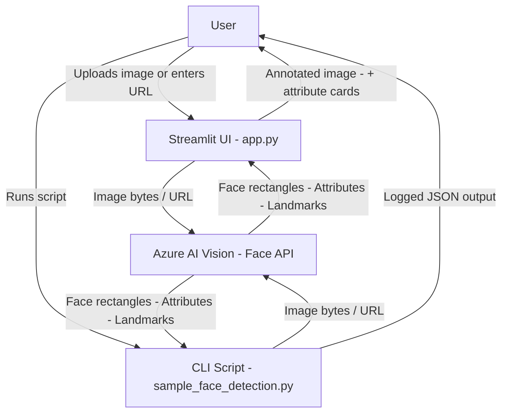
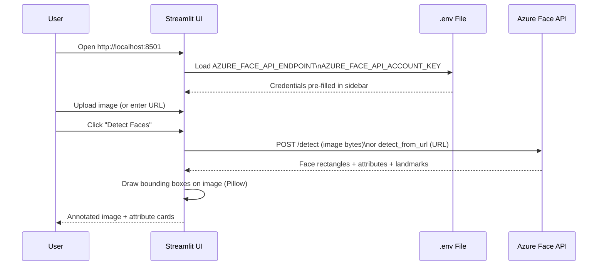
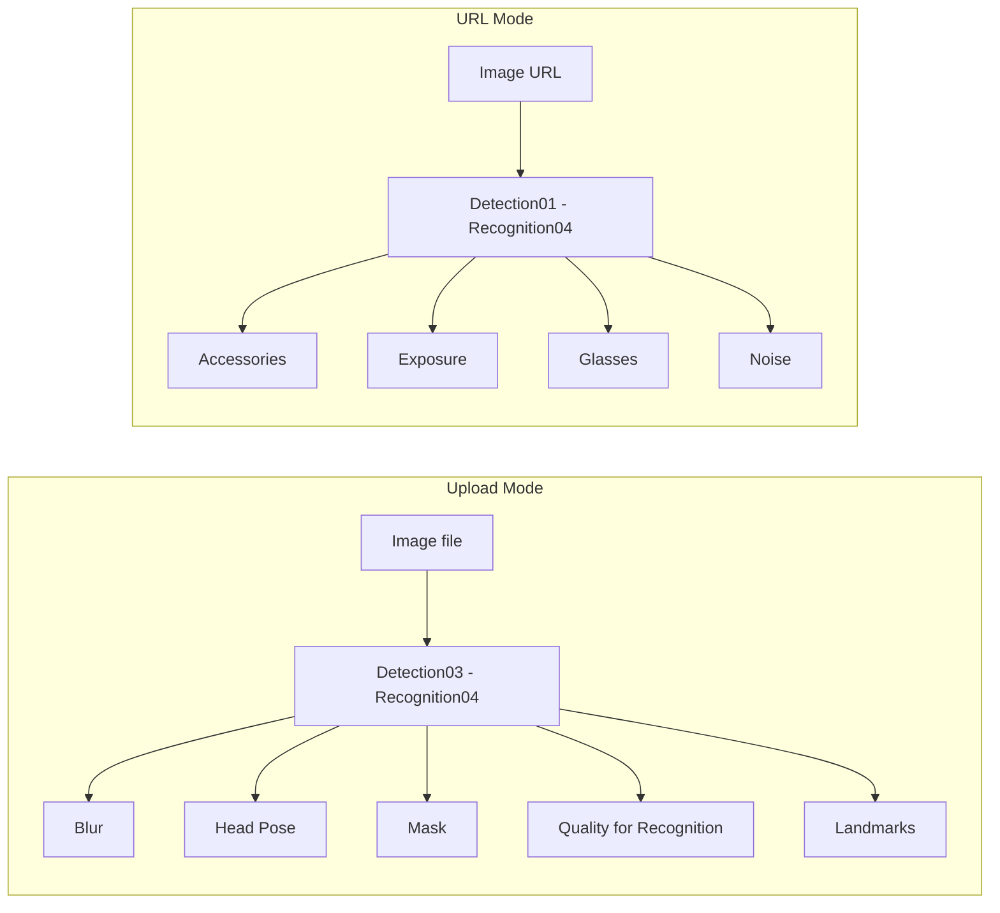

# Demo Lab — Azure Face Detection

This lab demonstrates real-time face detection using the **Azure AI Vision Face API**, exposed through two interfaces: a command-line script and an interactive Streamlit web UI.

---

## Files

| File | Description |
|------|-------------|
| `sample_face_detection.py` | CLI script — detects faces from a local image and a URL |
| `app.py` | Streamlit web UI — upload an image or enter a URL and visualise results |
| `.env` | API credentials (not committed) |
| `tomc1.jpeg` | Sample image used by the CLI script |

---

## Architecture

### System Overview



### Streamlit App Flow



### Detection Models



---

## Prerequisites

- Python 3.9+
- An **Azure AI Services** (or Face) resource with key and endpoint
- The `.venv` virtual environment in the repo root (already set up)

---

## Setup

1. **Add credentials to `.env`**

   ```
   AZURE_FACE_API_ENDPOINT=https://<your-resource>.cognitiveservices.azure.com/
   AZURE_FACE_API_ACCOUNT_KEY=<your-key>
   ```

2. **Activate the virtual environment**

   ```bash
   source ../../.venv/bin/activate
   ```

3. **Install dependencies** (first time only)

   ```bash
   pip install azure-ai-vision-face python-dotenv streamlit pillow
   ```

---

## Running

### CLI Script

Detects faces in `tomc1.jpeg` and then from a sample URL, printing full JSON results to the console.

```bash
python sample_face_detection.py
```

### Streamlit UI

```bash
streamlit run app.py
```

Then open **http://localhost:8501** in your browser.

---

## Attribute Reference

| Attribute | Available in | Description |
|-----------|-------------|-------------|
| `blur` | Upload (Detection03) | Blur level and score |
| `headPose` | Upload (Detection03) | Pitch, yaw, roll in degrees |
| `mask` | Upload (Detection03) | Mask type and nose/mouth coverage |
| `qualityForRecognition` | Upload (Recognition04) | `low` / `medium` / `high` |
| `accessories` | URL (Detection01) | Hat, glasses, mask, etc. |
| `exposure` | URL (Detection01) | Exposure level and score |
| `glasses` | URL (Detection01) | `NoGlasses`, `ReadingGlasses`, `Sunglasses`, `SwimmingGoggles` |
| `noise` | URL (Detection01) | Noise level and score |

---

## Notes

- `return_face_id=False` is set because face identification/verification requires [additional Microsoft approval](https://aka.ms/facerecognition).
- The `.env` file is loaded automatically; values entered in the sidebar override environment variables at runtime.
