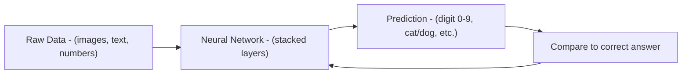
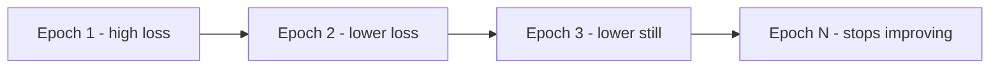
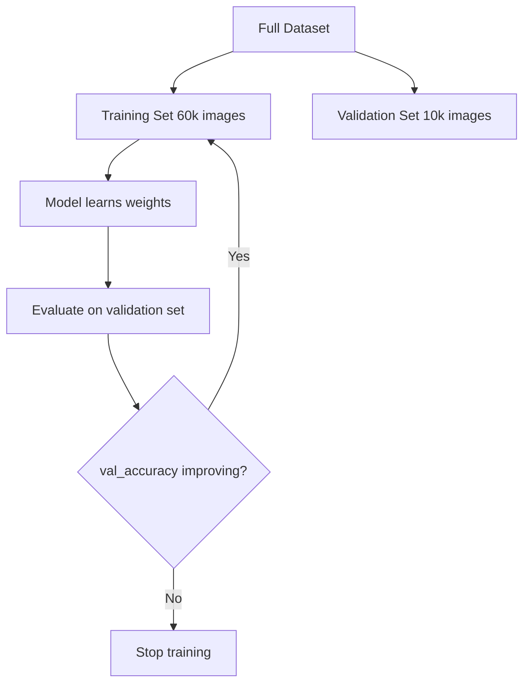
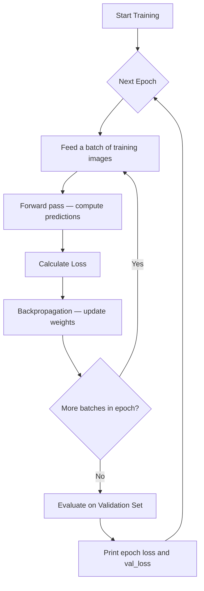
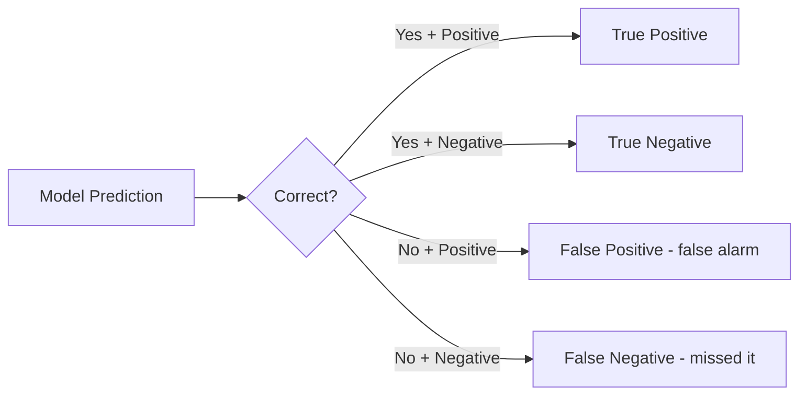
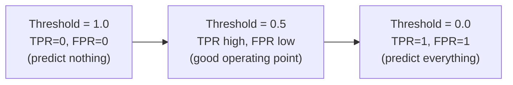

# Lab 0 — Introduction to Deep Learning with Keras & TensorFlow

This lab is designed for students who are new to deep learning. Before writing any complex code, we build intuition around three concepts you will encounter in every training run: **loss**, **validation**, and **epoch**.

---

## What is Deep Learning?

Deep learning is a branch of machine learning where **neural networks** — layers of simple mathematical operations stacked on top of each other — learn to recognize patterns directly from data.



The network improves by **repeatedly looking at examples** and adjusting its internal numbers (weights) to reduce mistakes. This adjustment process is called **training**.

---

## Core Concepts

### Epoch

> **An epoch is one complete pass through the entire training dataset.**

Imagine you are studying a set of 100 flashcards. Reading all 100 cards once = 1 epoch. Reading them again = 2 epochs.

| Epochs | What happens |
|--------|-------------|
| Too few | The network hasn't seen enough examples — it underfits (poor accuracy) |
| Too many | The network memorizes the training data — it overfits (poor on new data) |
| Just right | The network generalises — good accuracy on both training and test data |

A typical training run uses **5–20 epochs**. You watch the loss (see below) to decide when to stop.



---

### Loss

> **Loss is a number that measures how wrong the model's predictions are.**

A loss of `0.0` means every prediction was perfect. A high loss (e.g. `2.3` at the start of training) means the model is mostly guessing.

During training Keras prints the loss after each epoch:

```
Epoch 1/10 — loss: 2.3012 — accuracy: 0.1124
Epoch 2/10 — loss: 1.8432 — accuracy: 0.3301
Epoch 3/10 — loss: 0.6891 — accuracy: 0.8012
...
```

**How loss is calculated — Categorical Cross-Entropy (used for digit classification):**

The model outputs a probability for each digit 0–9. Cross-entropy penalises confident wrong answers much more than uncertain wrong answers.

$$
\text{Loss} = -\sum_{c=0}^{9} y_c \log(\hat{y}_c)
$$

Where $y_c$ is `1` for the correct class and `0` for all others, and $\hat{y}_c$ is the model's predicted probability for class $c$.

You do not need to implement this formula — Keras computes it automatically when you pass `loss='categorical_crossentropy'` to `model.compile()`.

---

### Validation

> **Validation is measuring how well the model performs on data it has never seen during training.**

The MNIST dataset is split into two parts:

| Set | Size | Purpose |
|-----|------|---------|
| Training set | 60,000 images | The model learns from these |
| Test / Validation set | 10,000 images | These are held back to measure real-world accuracy |

The model **never trains on the validation set**. This gives an honest measure of generalisation.



**Watching both losses:**

```
Epoch 5/10 — loss: 0.21 — accuracy: 0.94 — val_loss: 0.19 — val_accuracy: 0.95
```

- If `val_loss` keeps falling alongside `loss` → the model is generalising well.
- If `loss` falls but `val_loss` rises → **overfitting** — the model is memorising training data.

---

## The Three Concepts Together



---

## Evaluating Model Performance

After training, accuracy alone is not enough. A model that gets 98 % accuracy on MNIST might still be systematically wrong about certain digits. These four tools give a complete picture.

---

### TP, TN, FP, FN

Every prediction falls into one of four categories. Imagine we ask: **"Is this image a 7?"**

| | Predicted: 7 | Predicted: not 7 |
|---|---|---|
| **Actual: 7** | ✅ True Positive (TP) | ❌ False Negative (FN) |
| **Actual: not 7** | ❌ False Positive (FP) | ✅ True Negative (TN) |

- **TP** — correctly identified a 7
- **TN** — correctly rejected a non-7
- **FP** — called something a 7 when it wasn't (false alarm)
- **FN** — missed a real 7 (missed detection)



---

### Confusion Matrix

A **confusion matrix** extends TP/TN/FP/FN to all 10 digit classes at once. Each row is the **true** digit; each column is the **predicted** digit.

| | **Pred 0** | **Pred 1** | **Pred 2** | **…** | **Pred 9** |
|------------|-----------|-----------|-----------|-------|-----------|
| **True 0** | **970** | 0 | 2 | … | 1 |
| **True 1** | 0 | **1130** | 2 | … | 0 |
| **True 2** | 5 | 3 | **990** | … | 1 |
| **…** | … | … | … | … | … |
| **True 9** | 2 | 1 | 0 | … | **998** |

- **Diagonal cells** = correct predictions (TP for each class)
- **Off-diagonal cells** = mistakes — e.g. how many real 4s were predicted as 9s

The confusion matrix tells you **which digit pairs are hardest to tell apart** (e.g. 4 vs 9, 3 vs 5).

---

### Precision and Recall

Two complementary metrics, each answering a different question:

**Precision** — *"Of everything I predicted as a 7, how many actually were 7s?"*

$$\text{Precision} = \frac{TP}{TP + FP}$$

> I predicted "7" a total of 1 050 times. 1 000 were real 7s. Precision = 1000/1050 ≈ **0.952**

**Recall** (also called Sensitivity or True Positive Rate) — *"Of all the real 7s in the test set, how many did I find?"*

$$\text{Recall} = \frac{TP}{TP + FN}$$

> There are 1 028 real 7s. I correctly found 1 000. Recall = 1000/1028 ≈ **0.973**

**The trade-off:** pushing precision higher often lowers recall and vice versa.

| Scenario | Priority |
|----------|---------|
| Spam filter | High precision (don't block real emails) |
| Cancer screening | High recall (don't miss real cases) |
| Digit recognition | Balance both |

---

### F1 Score

The **F1 score** is the harmonic mean of precision and recall — it penalises extreme imbalances between the two.

$$F_1 = 2 \times \frac{\text{Precision} \times \text{Recall}}{\text{Precision} + \text{Recall}}$$

> Precision = 0.952, Recall = 0.973 → F1 = 2 × (0.952 × 0.973) / (0.952 + 0.973) ≈ **0.962**

- F1 = 1.0 → perfect
- F1 = 0.0 → completely wrong
- F1 < Accuracy → the model struggles on some classes more than others

---

### AUC — Area Under the ROC Curve

The **ROC curve** plots the True Positive Rate (Recall) against the False Positive Rate as the classification threshold varies.

$$\text{False Positive Rate (FPR)} = \frac{FP}{FP + TN}$$



The **AUC** (Area Under the Curve) summarises the ROC curve in a single number:

| AUC | Meaning |
|-----|---------|
| 1.0 | Perfect classifier — never wrong |
| 0.9 – 0.99 | Excellent |
| 0.7 – 0.9 | Good |
| 0.5 | Random guessing |
| < 0.5 | Worse than random |

For MNIST (10 classes) we draw **one ROC curve per digit** using the one-vs-rest strategy: each digit is treated as the positive class and all others as negatives. MNIST AUC values are typically > 0.999.

---

## Lab Notebook

Open `intro-keras.ipynb` in this folder. It walks through:

1. Loading the MNIST dataset
2. Preprocessing the images (flatten + normalise)
3. Building a minimal 2-layer Keras model
4. Compiling with `categorical_crossentropy` loss and the `adam` optimizer
5. Training for 10 epochs
6. Plotting the **loss and accuracy curves** with interpretation guidance
7. **Confusion matrix** — identifying which digit pairs are confused
8. **Precision, Recall, F1** — per-digit classification report
9. **AUC / ROC curves** — one curve per digit (one-vs-rest)

**Run it:**

```bash
# Make sure your virtual environment is active
source .venv/bin/activate        # macOS/Linux
.venv\Scripts\Activate.ps1       # Windows

jupyter notebook labs/lab-0/intro-keras.ipynb
```

---

## What's Next?

After completing Lab 0, move to **Lab 1** where you build a full MNIST classifier, tune hyperparameters, and compare different architectures.
