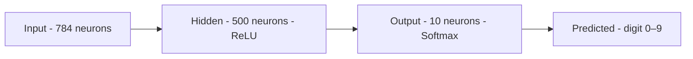

# Lab 1 — Full MNIST Classifier with Hyperparameter Tuning

This lab builds directly on **Lab 0**. You already understand epoch, loss, and validation — now you apply them to train a full MNIST classifier, visualise the activation functions that power it, and experiment with architecture choices to see how they affect performance.

---

## Prerequisites

Complete **Lab 0** (`labs/lab-0/intro-keras.ipynb`) before starting here.  
You should be comfortable with:

- Loading and preprocessing MNIST
- Building a `Sequential` model with `Dense` layers
- Compiling with `categorical_crossentropy` and `adam`
- Reading epoch-by-epoch loss and accuracy output

---

## What You Will Build

A feedforward neural network that classifies handwritten digits (0–9) with **> 97 % test accuracy**, then iterates on the architecture to understand what drives that number.




---

## New Concepts Introduced

### Activation Functions

Lab 0 named ReLU and Softmax. Lab 1 **plots them** so you can see exactly what they do to numbers passing through the network.

**ReLU** — *Rectified Linear Unit*

$$f(x) = \max(0,\ x)$$

- Negative inputs → output is zero (neuron "off")
- Positive inputs → output passes through unchanged (neuron "on")
- Cheap to compute; prevents the vanishing-gradient problem

**Softmax** — converts raw scores into a probability distribution

$$\hat{y}_c = \frac{e^{z_c}}{\sum_{j=0}^{9} e^{z_j}}$$

- All 10 outputs sum to exactly 1.0
- The class with the highest probability is the prediction

---

### Hyperparameter Tuning

A **hyperparameter** is a setting you choose before training begins — the model does not learn it from data.

| Hyperparameter | Lab 1 values explored | Effect |
|----------------|----------------------|--------|
| Hidden neurons | 500 → 50 | Fewer neurons = faster but may underfit |
| Batch size | 256 → 512 | Larger batch = faster epochs, noisier gradients |
| Epochs | 50 | Enough to see convergence and potential overfitting |

Comparing training curves lets you decide which combination generalises best.

---

### Dropout — Fighting Overfitting

**Dropout** is a regularisation technique: during each training step, a random fraction of neurons are temporarily switched off.


$$\text{Dropout rate} = 0.3 \Rightarrow 30\% \text{ of neurons zeroed per step}$$

- **During training** — forces the network to learn redundant representations
- **During inference** — all neurons are active; weights are scaled automatically
- **Net effect** — reduces overfitting; `val_loss` tracks `loss` more closely

---

## Notebooks

| Notebook | Description |
|----------|-------------|
| `MINST.ipynb` | Step-by-step walkthrough with detailed markdown explanations |
| `MINST-low-code.ipynb` | Same pipeline in fewer lines — focus on the code patterns |
| `sample-MNIST.ipynb` | Additional examples and experiments |

---

## Evaluating Your Model

Use the tools introduced in Lab 0:

| Tool | What to look for |
|------|-----------------|
| Loss & accuracy curves | `val_loss` and `loss` should converge; rising `val_loss` = overfitting |
| Confusion matrix | Which digit pairs does the model mix up? |
| Precision / Recall / F1 | Are some digits harder than others? |

---

## Architecture Experiments

The lab walks through three model variants. Compare their final `val_accuracy`:

**Variant A — Large hidden layer (baseline)**
```
Input(784) → Dense(500, relu) → Dense(10, softmax)
```

**Variant B — Smaller hidden layer**
```
Input(784) → Dense(50, relu) → Dense(10, softmax)
```

**Variant C — Smaller layer + Dropout**
```
Input(784) → Dense(50, relu) → Dropout(0.3) → Dense(10, softmax)
```

| Variant | Parameters | Typical val_accuracy | Overfitting risk |
|---------|-----------|---------------------|-----------------|
| A — Dense(500) | ~397 k | ~98 % | Low–moderate |
| B — Dense(50) | ~40 k | ~97 % | Low |
| C — Dense(50) + Dropout | ~40 k | ~97 % | Lower still |

---

## Run the Notebooks

```bash
# Activate your virtual environment first
source .venv/bin/activate        # macOS/Linux
.venv\Scripts\Activate.ps1       # Windows

jupyter notebook labs/lab-1/MINST.ipynb
```

---

## What's Next?

After Lab 1 you have a solid single-layer classifier. Later labs explore:

- Convolutional layers (CNNs) — exploit the 2-D structure of images
- Callbacks — early stopping, learning-rate schedules
- Multi-modal models — combining images with other data types
