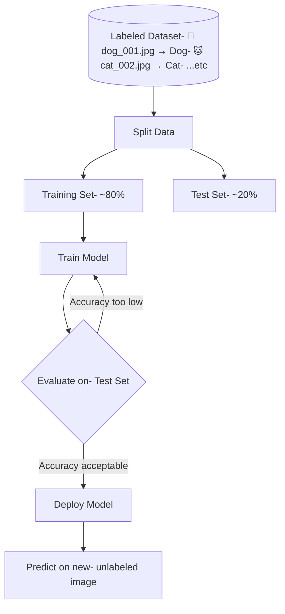
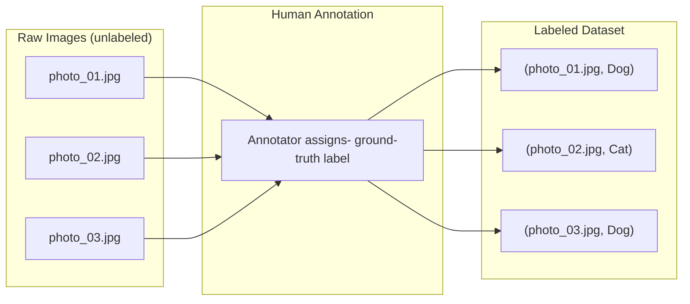
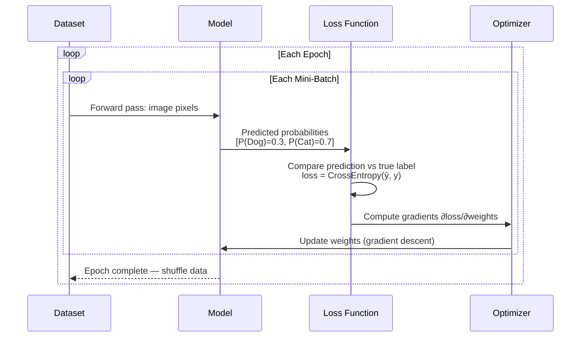
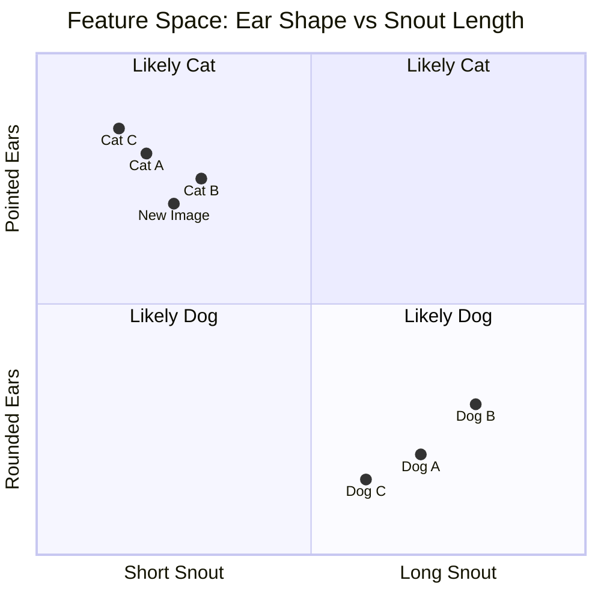
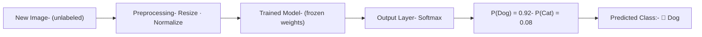
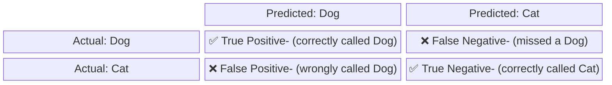
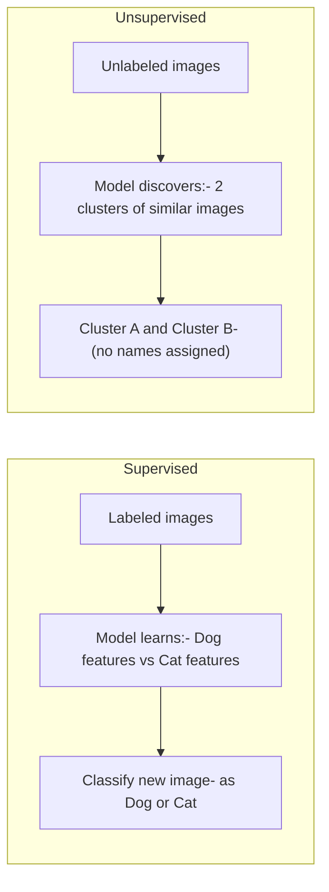

# Supervised Learning: Image Classification

> **Audience:** CS students  
> **Example domain:** Classifying images as `Dog` or `Cat`

---

## What is Supervised Learning?

Supervised learning trains a model on **labeled examples** — pairs of (input, correct answer). The model learns a function $f$ such that:

$$f(x) \approx y$$

where $x$ is an input image and $y \in \{\text{Dog}, \text{Cat}\}$.

---

## 1. The Big Picture

---

## 2. Building the Training Dataset

Each example in the dataset is a **(feature, label)** pair. For images, features are pixel values.

> **Key point:** The model never sees the labels during inference — they exist only to guide training.

---

## 3. The Training Loop

Training iterates over the dataset repeatedly (each full pass = one **epoch**).

**Loss decreases** as the model improves. Training stops when loss plateaus or validation accuracy peaks.

---

## 4. Decision Boundary

The model learns to separate the feature space into regions:

The **decision boundary** is the line the model draws between classes. Points on one side → Dog; the other → Cat.

---

## 5. Inference Pipeline

Once trained, the model classifies new images it has never seen:

The **softmax** function converts raw scores (logits) into probabilities that sum to 1:

$$P(\text{Dog}) = \frac{e^{z_{\text{Dog}}}}{e^{z_{\text{Dog}}} + e^{z_{\text{Cat}}}}$$

---

## 6. Evaluating the Model

A **confusion matrix** shows where the model succeeds and fails:

Key metrics derived from the confusion matrix:

| Metric | Formula | Meaning |
|---|---|---|
| **Accuracy** | $(TP + TN) / N$ | Overall correct predictions |
| **Precision** | $TP / (TP + FP)$ | Of predicted Dogs, how many were Dogs? |
| **Recall** | $TP / (TP + FN)$ | Of actual Dogs, how many did we catch? |
| **F1 Score** | $2 \cdot \frac{P \cdot R}{P + R}$ | Harmonic mean of precision & recall |

---

## 7. Supervised vs Unsupervised (Quick Contrast)

Supervised learning **requires labels** but produces interpretable, task-specific outputs. Unsupervised learning finds hidden structure but doesn't know what the clusters *mean*.

---

## Key Vocabulary

| Term | Definition |
|---|---|
| **Label** | The correct answer for a training example (`Dog` or `Cat`) |
| **Feature** | An input variable used for prediction (pixel values, edge intensities) |
| **Epoch** | One full pass through the training dataset |
| **Loss** | Numeric measure of how wrong the model's prediction was |
| **Gradient Descent** | Optimization algorithm that iteratively reduces loss |
| **Overfitting** | Model memorizes training data but fails on new data |
| **Generalization** | Model performs well on unseen examples |

