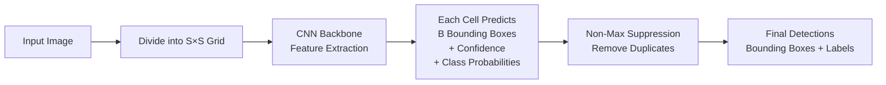
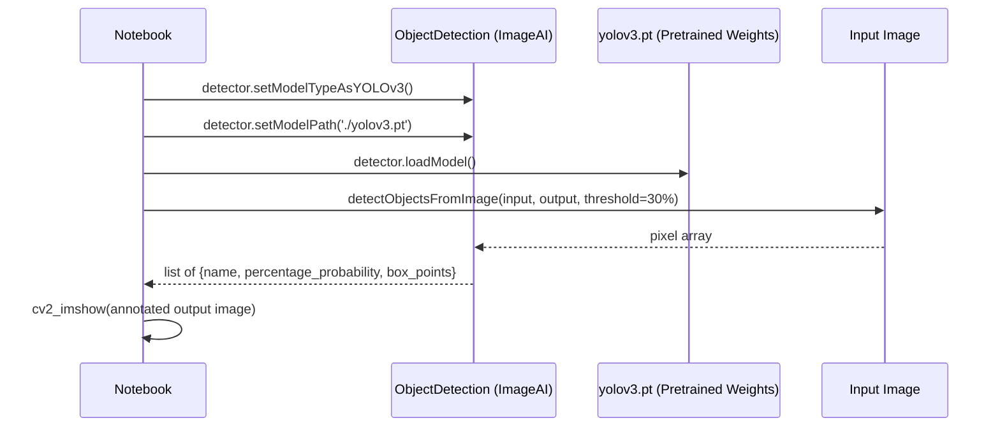
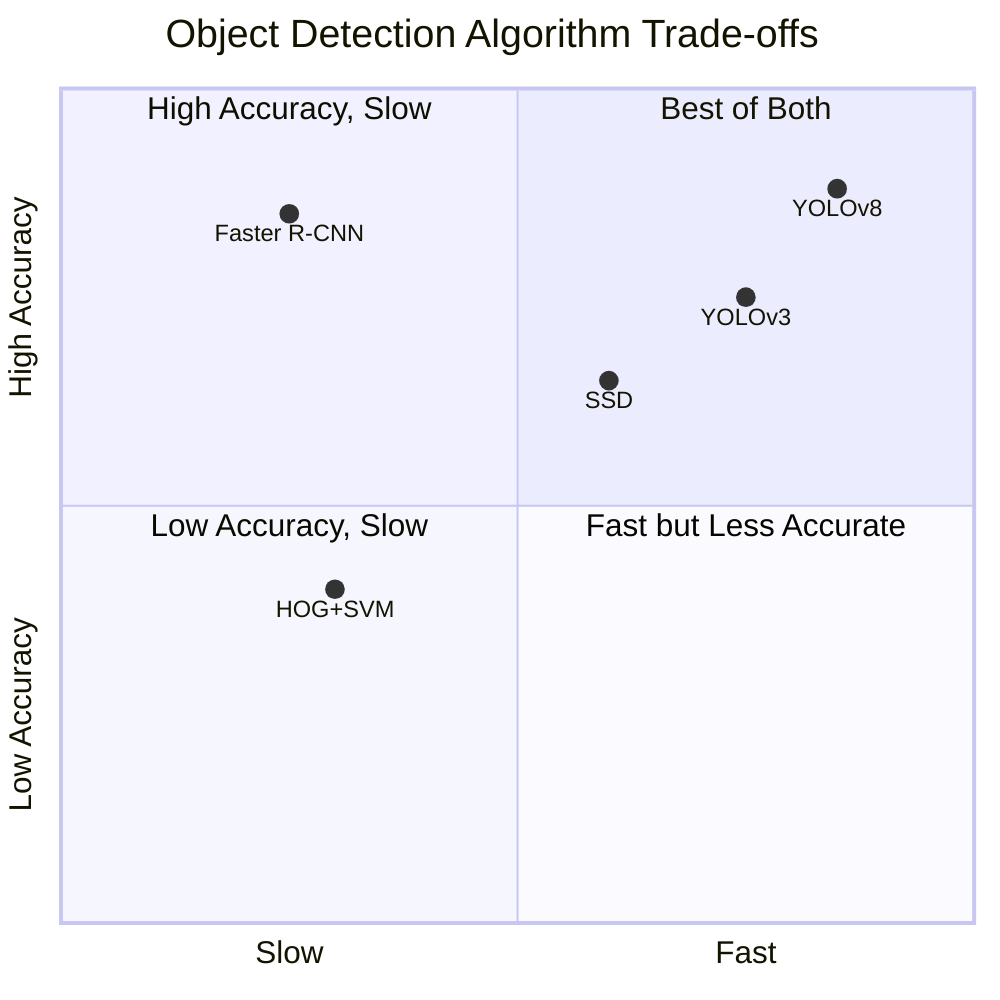
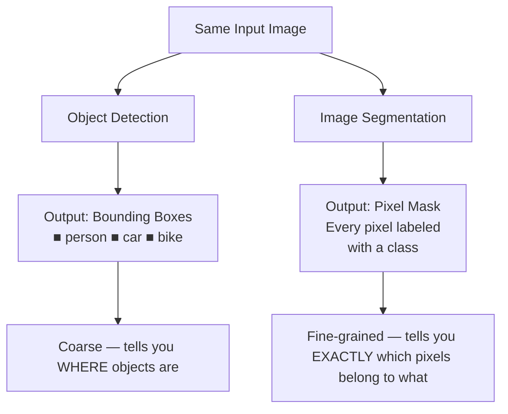
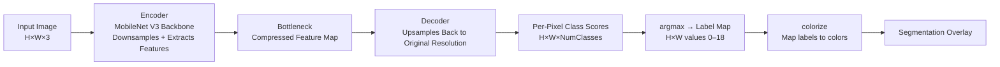
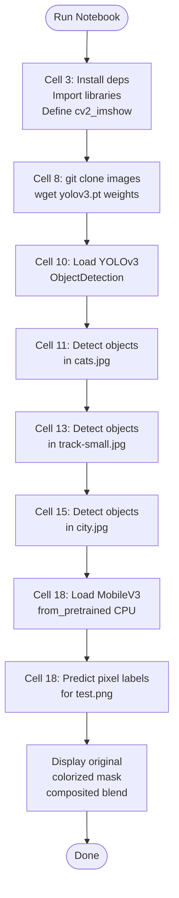
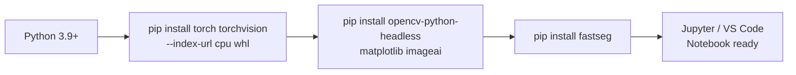

# Introduction to Computer Vision
### Object Detection & Image Segmentation — CS Student Reference

---

## Overview

This notebook introduces two core computer vision tasks using **pretrained models**:

| Task | Algorithm | Library | Use Case |
|---|---|---|---|
| Object Detection | YOLOv3 | ImageAI + PyTorch | Locate & label objects with bounding boxes |
| Image Segmentation | MobileNet V3 | FastSeg + PyTorch | Classify every pixel in an image |

---

## What Is Computer Vision?

Computer Vision (CV) is a field of AI that trains machines to interpret and understand visual data (images, video). The three main tasks are:

- **Classification** — *What is in this image?* (single label per image)
- **Object Detection** — *What is in this image, and where?* (label + bounding box per object)
- **Segmentation** — *Which pixels belong to which object?* (per-pixel classification)

---

## Part 1 — Object Detection with YOLOv3

### How YOLO Works

**YOLO** (You Only Look Once) treats detection as a single regression problem — it divides the image into a grid and predicts bounding boxes and class probabilities simultaneously in one forward pass.

### Key Concepts

- **Bounding Box** — `(x, y, width, height)` rectangle around a detected object
- **Confidence Score** — how certain the model is that an object exists in that box
- **IoU (Intersection over Union)** — measure of overlap between predicted and ground-truth boxes; used to evaluate accuracy
- **Non-Max Suppression (NMS)** — removes duplicate detections by keeping only the highest-confidence box when boxes overlap significantly
- **`minimum_percentage_probability`** — threshold below which detections are discarded (set to 30% in this notebook)

### YOLOv3 Pipeline in This Notebook

### Why YOLOv3?

YOLOv3 hits a good balance — suitable for scenes with medium/large objects where you need real-time or near-real-time performance.

---

## Part 2 — Image Segmentation with MobileNet V3

### Detection vs. Segmentation

### How MobileNet V3 Segmentation Works

MobileNet V3 is a lightweight **encoder-decoder** CNN designed for efficiency on mobile/edge hardware.

### Cityscapes Classes (Labels 0–18)

The FastSeg model is pretrained on the **Cityscapes** dataset — urban street scenes. The 19 classes are:

| Label | Class | Label | Class |
|---|---|---|---|
| 0 | road | 10 | sky |
| 1 | sidewalk | 11 | person |
| 2 | building | 12 | rider |
| 3 | wall | 13 | car |
| 4 | fence | 14 | truck |
| 5 | pole | 15 | bus |
| 6 | traffic light | 16 | train |
| 7 | traffic sign | 17 | motorcycle |
| 8 | vegetation | 18 | bicycle |
| 9 | terrain | | |

---

## Notebook Execution Flow

---

## Environment Setup (macOS / Local)

> **Note:** `opencv-python-headless` is used instead of `opencv-python` to avoid GUI/Qt conflicts on macOS in headless notebook environments. CUDA is not required — all inference runs on CPU.

---

## Common Errors & Fixes

| Error | Cause | Fix |
|---|---|---|
| `ModuleNotFoundError: No module named 'cv2'` | Old pinned deps conflict with opencv | Use `opencv-python-headless` without version pins |
| `AssertionError: Torch not compiled with CUDA enabled` | `.cuda()` called on a CPU-only build | Remove `.cuda()` — use CPU |
| `ModuleNotFoundError: google.colab` | Colab-specific import in local env | Remove `from google.colab.patches import cv2_imshow`, use local replacement |
| `wget: command not found` | macOS lacks wget by default | Run `brew install wget` or replace with `curl -L -o yolov3.pt <url>` |

---

## Further Reading

- [ImageAI Documentation](https://imageai.readthedocs.io/en/latest/)
- [FastSeg GitHub (MobileNet V3)](https://github.com/ekzhang/fastseg)
- [Original YOLO Paper — Redmon et al.](https://arxiv.org/abs/1506.02640)
- [MobileNetV3 Paper — Howard et al.](https://arxiv.org/abs/1905.02244)
- [Cityscapes Dataset](https://www.cityscapes-dataset.com/)

